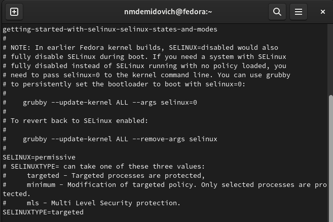
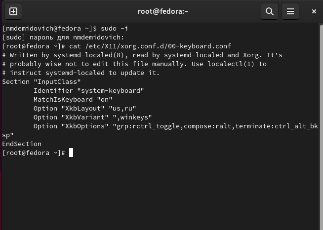
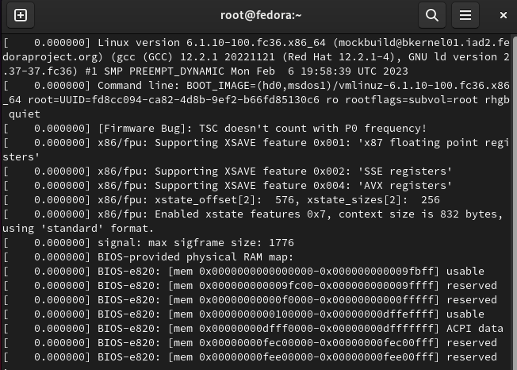

---
## Front matter
title: "Лабораторная работа №1"
subtitle: "НКАбд-01-22"
author: "Никита Михайлович Демидович"

## Generic otions
lang: ru-RU
toc-title: "Содержание"

## Bibliography
bibliography: bib/cite.bib
csl: pandoc/csl/gost-r-7-0-5-2008-numeric.csl

## Pdf output format
toc: true # Table of contents
toc-depth: 2
lof: true # List of figures
lot: true # List of tables
fontsize: 12pt
linestretch: 1.5
papersize: a4
documentclass: scrreprt
## I18n polyglossia
polyglossia-lang:
  name: russian
  options:
	- spelling=modern
	- babelshorthands=true
polyglossia-otherlangs:
  name: english
## I18n babel
babel-lang: russian
babel-otherlangs: english
## Fonts
mainfont: PT Serif
romanfont: PT Serif
sansfont: PT Sans
monofont: PT Mono
mainfontoptions: Ligatures=TeX
romanfontoptions: Ligatures=TeX
sansfontoptions: Ligatures=TeX,Scale=MatchLowercase
monofontoptions: Scale=MatchLowercase,Scale=0.9
## Biblatex
biblatex: true
biblio-style: "gost-numeric"
biblatexoptions:
  - parentracker=true
  - backend=biber
  - hyperref=auto
  - language=auto
  - autolang=other*
  - citestyle=gost-numeric
## Pandoc-crossref LaTeX customization
figureTitle: "Рис."
tableTitle: "Таблица"
listingTitle: "Листинг"
lofTitle: "Список иллюстраций"
lotTitle: "Список таблиц"
lolTitle: "Листинги"
## Misc options
indent: true
header-includes:
  - \usepackage{indentfirst}
  - \usepackage{float} # keep figures where there are in the text
  - \floatplacement{figure}{H} # keep figures where there are in the text
---

# Цель работы

Целью данной работы является приобретение практических навыков установки операционной системы на виртуальную машину, настройки минимально необходимых для дальнейшей работы сервисов.

# Задание

Настройка каталога для виртуальных машин
Создание необходимых каталогов

Запустите терминал. Перейдите в каталог /var/tmp:

cd /var/tmp
Создайте каталог с именем пользователя (совпадающий с логином студента в дисплейном классе). Для этого можно использовать команду:

mkdir /var/tmp/`id -un`
Проверьте в свойствах VirtualBox месторасположение каталога для виртуальных машин:

/var/tmp/имя_пользователя
Здесь имя_пользователя — логин (учётная запись) студента в дисплейном классе. Если указан другой каталог, то требуется изменить его.
Папка виртуальных машин

Значения по умолчанию

Linux: $HOME/VirtualBox VMs.
Графический интерфейс

В меню выберите Файл, Настройки.
Выберите Общие, поле Папка для машин по умолчанию.
Установите новое значение, например /var/tmp/имя_пользователя.
Нажмите ОК, чтобы сохранить изменения.
Командная строка

Установим папку для виртуальных машине в /var/tmp/имя_пользователя:

VBoxManage setproperty machinefolder /var/tmp/имя_пользователя

Настройка хост-клавиши
Хост-клавишей по умолчанию является правый Ctrl.
По умолчанию в дисплейных классах на клавише правый Ctrl находится переключатель языка ввода.
Эти значения могут конфликтовать.
Графический интерфейс

В меню выберите Файл, Настройки.
Выберите Ввод, вкладка Виртуальная машина.
Выберите Сочетание клавиш в строке Хост-комбинация.
Нажмите новое сочетание клавиш.
Нажмите ОК, чтобы сохранить изменения.
Командная строка

Проверьте текущую комбинацию для хост-клавиши:

VBoxManage getextradata global GUI/Input/HostKeyCombination
По умолчанию установлена комбинация 65508, соответствующая правой клавише Ctrl.
Установите нужную клавишу (в примере клавиша Menu):

VBoxManage setextradata global GUI/Input/HostKeyCombination 65383
Комбинации клавиш можно, например, посмотреть на странице https://pythonhosted.org/pyglet/api/pyglet.window.key-module.html.

Создание виртуальной машины
Запустите менеджер виртуальных машин, введя в командной строке:

VirtualBox &
Создайте новую виртуальную машину.
Укажите имя виртуальной машины (ваш логин в дисплейном классе), тип операционной системы — Linux, Fedora.
Укажите размер основной памяти виртуальной машины — от 2048 МБ.
Задайте конфигурацию жёсткого диска — загрузочный, VDI (VirtualBox Disk Image), динамический виртуальный диск.
Задайте размер диска — 80 ГБ (или больше), его расположение — в данном случае /var/tmp/имя_пользователя/fedora.vdi.
Выберите в VirtualBox Вашей виртуальной машины. Добавьте новый привод оптических дисков и выберите образ.
При установке на собственной технике используйте скачанный образ операционной системы Fedora.

Установка операционной системы

Запуск приложения для установки системы
Загрузите LiveCD.
Появится интерфейс начальной конфигурации.
Нажмите Enter для создания конфигурации по умолчанию.
Нажмите Enter, чтобы выбрать в качестве модификатора клавишу Win (она же клавиша Super).
В файле конфигурации эта клавиша будет обозначена как $Mod.
Нажмите комбинацию Win+Enter для запуска терминала.
В терминале запустите liveinst.
Для перехода к раскладке окон с табами нажмите Win+w.

Установка системы на диск
Выберите язык интерфейса и перейдите к настройкам установки операционной системы.
При необходимости скорректируйте часовой пояс, раскладку клавиатуры (рекомендуется в качестве языка по умолчанию указать английский язык).
Место установки ОС оставьте без изменения.
Установите имя и пароль для пользователя root.
Установите имя и пароль для Вашего пользователя.
Задайте сетевое имя Вашего компьютера.
После завершения установки операционной системы корректно перезапустите виртуальную машину.
В VirtualBox оптический диск должен отключиться автоматически, но если это не произошло, то необходимо отключить носитель информации с образом.

После установки
Войдите в ОС под заданной вами при установке учётной записью.
Нажмите комбинацию Win+Enter для запуска терминала.
Переключитесь на роль супер-пользователя:

sudo -i

Обновления
Обновить все пакеты

dnf -y update

Повышение комфорта работы
Программы для удобства работы в консоли:

dnf install tmux mc

Автоматическое обновление
При необходимости можно использовать автоматическое обновление.
Установка программного обеспечения:

dnf install dnf-automatic
Задаёте необходимую конфигурацию в файле /etc/dnf/automatic.conf.
Запустите таймер:

systemctl enable --now dnf-automatic.timer

Отключение SELinux
В данном курсе мы не будем рассматривать работу с системой безопасности SELinux.
Поэтому отключим его.
В файле /etc/selinux/config замените значение

SELINUX=enforcing
на значение

SELINUX=permissive
Перегрузите виртуальную машину:

reboot

Установка драйверов для VirtualBox
Войдите в ОС под заданной вами при установке учётной записью.
Нажмите комбинацию Win+Enter для запуска терминала.
Запустите терминальный мультиплексор tmux:

tmux
Переключитесь на роль супер-пользователя:

sudo -i
Установите пакет DKMS:

dnf -y install dkms
В меню виртуальной машины подключите образ диска дополнений гостевой ОС.
Подмонтируйте диск:

mount /dev/sr0 /media
Установите драйвера:

/media/VBoxLinuxAdditions.run
Перегрузите виртуальную машину:

reboot

Настройка раскладки клавиатуры
Войдите в ОС под заданной вами при установке учётной записью.
Нажмите комбинацию Win+Enter для запуска терминала.
Запустите терминальный мультиплексор tmux:

tmux
Переключитесь на роль супер-пользователя:

sudo -i
Отредактируйте конфигурационный файл /etc/X11/xorg.conf.d/00-keyboard.conf:

Section "InputClass"
        Identifier "system-keyboard"
        MatchIsKeyboard "on"
        Option "XkbLayout" "us,ru"
        Option "XkbVariant" ",winkeys"
        Option "XkbOptions" "grp:rctrl_toggle,compose:ralt,terminate:ctrl_alt_bksp"
EndSection
Для этого можно использовать файловый менеджер mc и его встроенный редактор.
Перегрузите виртуальную машину:

reboot

Установка имени пользователя и названия хоста
Если при установке виртуальной машины вы задали имя пользователя или имя хоста, не удовлетворяющее соглашению об именовании, то вам необходимо исправить это.
Запустите виртуальную машину и залогиньтесь.
Нажмите комбинацию Win+Enter для запуска терминала.
Запустите терминальный мультиплексор tmux:

tmux
Переключитесь на роль супер-пользователя:

sudo -i
Создайте пользователя (вместо username укажите ваш логин в дисплейном классе):

adduser -G wheel username
Задайте пароль для пользователя (вместо username укажите ваш логин в дисплейном классе):

passwd username
Установите имя хоста (вместо username укажите ваш логин в дисплейном классе):

hostnamectl set-hostname username
Проверьте, что имя хоста установлено верно:

hostnamectl

Установка программного обеспечения для создания документации
Нажмите комбинацию Win+Enter для запуска терминала.
Запустите терминальный мультиплексор tmux:

tmux
Переключитесь на роль супер-пользователя:

sudo -i

pandoc
Установим pandoc:

dnf -y install pandoc
Установите необходимые расширения:

pip install pandoc-fignos pandoc-eqnos pandoc-tablenos pandoc-secnos --user

texlive
Установим дистрибутив TeXlive:

dnf -y install texlive texlive-\*

# Теоретическое введение

Операционная система (ОС) — это комплекс взаимосвязанных программ, предназначенных для управления ресурсами компьютера и организации взаимодействия с пользователем. Сегодня наиболее известными операционными системами являются ОС семейства Microsoft Windows и UNIX-подобные системы.
GNU Linux — семейство переносимых, многозадачных и многопользовательских операционных систем, на базе ядра Linux, включающих тот или иной набор
утилит и программ проекта GNU, и, возможно, другие компоненты. Как и ядро
Linux, системы на его основе, как правило, создаются и распространяются в
соответствии с моделью разработки свободного и открытого программного обеспечения (Open-Source Software). Linux-системы распространяются в основном
бесплатно в виде различных дистрибутивов.

Дистрибутив GNU Linux — общее определение ОС, использующих ядро Linux
и набор библиотек и утилит, выпускаемых в рамках проекта GNU, а также графическую оконную подсистему X Window System. Дистрибутив готов для конечной установки на пользовательское оборудование. Кроме ядра и, собственно,
операционной системы дистрибутивы обычно содержат широкий набор приложений, таких как редакторы документов и таблиц, мультимедийные проигрыватели, системы для работы с базами данных и т.д. Существуют дистрибутивы,
разрабатываемые как при коммерческой поддержке (Red Hat / Fedora, SLED
/ OpenSUSE, Ubuntu), так и исключительно усилиями добровольцев (Debian,
Slackware, Gentoo, ArchLinux).

Работу ОС GNU Linux можно представить в виде функционирования множества взаимосвязанных процессов. При загрузке системы сначала запускается
ядро, которое, в свою очередь, запускает оболочку ОС (от англ. shell «оболочка»).
Взаимодействие пользователя с системой Linux (работа с данными и управление работающими в системе процессами) происходит в интерактивном режиме
посредством командного языка. Оболочка операционной системы (или командная оболочка, интерпретатор команд) — интерпретирует (т.е. переводит на
машинный язык) вводимые пользователем команды, запускает соответствующие программы (процессы), формирует и выводит ответные сообщения. Кроме
того, на языке командной оболочки можно писать небольшие программы для
выполнения ряда последовательных операций с файлами и содержащимися в
них данными — сценарии (скрипты).
Из командных оболочек GNU Linux наиболее популярны bash, csh, ksh, zsh.
Команда echo $SHELL позволяет проверить, какая оболочка используется. В
качестве предустановленной командной оболочки GNU Linux используется одна
из наиболее распространённых разновидностей командной оболочки — bash
(Bourne again shell).

Интерфейс командной оболочки очень прост. Обычно он состоит из приглашения командной строки (строки, оканчивающейся символом $), по которому
пользователь вводит команды:
iivanova@dk4n31:~$
Это приглашение командной оболочки, которое несёт в себе информацию об
имени пользователя iivanova, имени компьютера dk4n31 и текущем каталоге,
в котором находится пользователь, в данном случае это домашний каталог
пользователя, обозначенный как ~).
Команды могут быть использованы с ключами (или опциями) — указаниями,
модифицирующими поведение команды. Ключи обычно начинаются с символа
(-) или (--) и часто состоят из одной буквы. Кроме ключей после команды
могут быть использованы аргументы (параметры) — названия объектов, для
которых нужно выполнить команду (например, имена файлов и каталогов).
Например, для подробного просмотра содержимого каталога documents может
быть использована команда ls с ключом -l:
iivanova@dk4n31:~$ ls -l documents

В данном случае ls – это имя команды, l – ключ, documents – аргумент. Команды, ключи и аргументы должны быть отделены друг от друга пробелом.
Ввод команды завершается нажатием клавиши Enter , после чего команда
передаётся оболочке на исполнение. Результатом выполнения команды могут
являться сообщения о ходе выполнения команды или об ошибках. Появление
приглашения командной строки говорит о том, что выполнение команды завершено.
Иногда в GNU Linux имена программ и команд слишком длинные, однако
bash может завершать имена при их вводе в терминале. Нажав клавишу Tab ,
можно завершить имя команды, программы или каталога. Например, предположим, что нужно использовать программу mcedit. Для этого наберите в
командной строке mc, затем нажмите один раз клавишу Tab. Если ничего не
происходит, то это означает, что существует несколько возможных вариантов
завершения команды. Нажав клавишу Tab ещё раз, можно получить список
имён, начинающихся с mc:
iivanova@dk4n31:~$ mc
mc mcd mcedit mclasserase mcookie mcview
mcat mcdiff mcheck mcomp mcopy
iivanova@dk4n31:~$ mc

# Выполнение лабораторной работы

На первом этапе выполения лабораторной работы необходимо произвести установку одного из
дистибутивов Linux на виртуальную машину. Это было сделано ранее (при выполнении
лабораторной работы №1 в 1-м семестре). 

Далее мною были установлены pandoc и TexLive, которые необходимы для дальнейшей работы.
Ранее мною было произведено обновление всех пакетов, после чего я огранизовал подключение а
втоматического обновления.

{ #fig:001 width=70% }
{ #fig:002 width=70% }

Далее я отключил системы безопасности SELinux. Для этого я открыл файл /etc/selinux/config
с помощью стороннего графнического файлового редактора и изменил значение SELINUX=enforcing на
SELINUX=permissive, после чего я перезагрузил виртуальную машину (рис.4.1).

{ #fig:003 width=70% }

На следующим этапе выполнения лабораторной работы необходимо произвести установку необходимых
драйверов для виртуальной машины. В связи с тем, что я устанливал виртуальную машину на основную
ОС Windows, мною не был выполнен данный пункт, ввиду ненабности. Он предполагается для выполения
лишь в случае, если виртуальная машина устанавливается на ОС Linux.

Далее необходимо настроить раскладку клавиатуры. Она была настроена мной при первоначальном
запуске дистрибутива через графический интерфейс. Для демонстрации этого я открыл
конфигурационный файл /etc/X11/xorg.conf.d/00-keyboard.conf (рис.4.2).

{ #fig:004 width=70% }

После этого необходимо было задать имя пользователя и хоста. Это также было сделано мною
ранее при первоначальной настройке дистрибутива (рис.4.3).

{ #fig:005 width=70% }

Затем я произвёл вывод команды dmesg | less (рис.4.4).

{ #fig:006 width=70% }

# Выводы

В результате выполнения данной лабораторной работы я приобрёл практические навыки 
установки операционной системы на виртуальную машину и настройки минимально необходимых 
для дальнейшей работы сервисов.

# Список литературы{.unnumbered}

Лабораторная работа №1 (Архитектура ЭВМ).
