---
## Front matter
title: "Лабораторная работа №9"
subtitle: "НКАбд-01-22"
author: "Никита Михайлович Демидович"

## Generic otions
lang: ru-RU
toc-title: "Содержание"

## Bibliography
bibliography: bib/cite.bib
csl: pandoc/csl/gost-r-7-0-5-2008-numeric.csl

## Pdf output format
toc: true # Table of contents
toc-depth: 2
lof: true # List of figures
lot: true # List of tables
fontsize: 12pt
linestretch: 1.5
papersize: a4
documentclass: scrreprt
## I18n polyglossia
polyglossia-lang:
  name: russian
  options:
	- spelling=modern
	- babelshorthands=true
polyglossia-otherlangs:
  name: english
## I18n babel
babel-lang: russian
babel-otherlangs: english
## Fonts
mainfont: PT Serif
romanfont: PT Serif
sansfont: PT Sans
monofont: PT Mono
mainfontoptions: Ligatures=TeX
romanfontoptions: Ligatures=TeX
sansfontoptions: Ligatures=TeX,Scale=MatchLowercase
monofontoptions: Scale=MatchLowercase,Scale=0.9
## Biblatex
biblatex: true
biblio-style: "gost-numeric"
biblatexoptions:
  - parentracker=true
  - backend=biber
  - hyperref=auto
  - language=auto
  - autolang=other*
  - citestyle=gost-numeric
## Pandoc-crossref LaTeX customization
figureTitle: "Рис."
tableTitle: "Таблица"
listingTitle: "Листинг"
lofTitle: "Список иллюстраций"
lotTitle: "Список таблиц"
lolTitle: "Листинги"
## Misc options
indent: true
header-includes:
  - \usepackage{indentfirst}
  - \usepackage{float} # keep figures where there are in the text
  - \floatplacement{figure}{H} # keep figures where there are in the text
---

# Цель работы

Познакомиться с операционной системой Linux. Получить практические навыки работы с редактором Emacs.

# Задание

1. Открыть emacs.

2. Создать файл lab07.sh с помощью комбинации Ctrl-x Ctrl-f (C-x C-f).

3. Наберите текст:

```#!/bin/bash
HELL=Hello
function hello {
  LOCAL HELLO=World
  echo $HELLO
}
```

4. Сохранить файл с помощью комбинации Ctrl-x Ctrl-s (C-x C-s).

5. Проделать с текстом стандартные процедуры редактирования, каждое действие должно осуществляться комбинацией клавиш:

   - 5.1. Вырезать одной командой целую строку (С-k).

   - 5.2. Вставить эту строку в конец файла (C-y).

   - 5.3. Выделить область текста (C-space).

   - 5.4. Скопировать область в буфер обмена (M-w).

   - 5.5. Вставить область в конец файла.

   - 5.6. Вновь выделить эту область и на этот раз вырезать её (C-w).
   
   - 5.7. Отмените последнее действие (C-/).

6. Познакомиться с командами по перемещению курсора:

   - 6.1. Переместите курсор в начало строки (C-a).

   - 6.2. Переместите курсор в конец строки (C-e).

   - 6.3. Переместите курсор в начало буфера (M-<).

   - 6.4. Переместите курсор в конец буфера (M->).

7. Научиться управлять буферами:

   - 7.1. Вывести список активных буферов на экран (C-x C-b).

   - 7.2. Переместитесь во вновь открытое окно (C-x) o со списком открытых буферов

и переключитесь на другой буфер.

   - 7.3. Закройте это окно (C-x 0).

   - 7.4. Теперь вновь переключайтесь между буферами, но уже без вывода их списка на
экран (C-x b).

8. Научиться управлять окнами.

   - 8.1. Поделите фрейм на 4 части: разделите фрейм на два окна по вертикали (C-x 3), а затем каждое из этих окон на две части по горизонтали (C-x 2).

   - 8.2. В каждом из четырёх созданных окон откройте новый буфер (файл) и введите
несколько строк текста.

9. Ознакомиться с режимом поиска.

   - 9.1. Переключитесь в режим поиска (C-s) и найдите несколько слов, присутствующих
в тексте.

   - 9.2. Переключайтесь между результатами поиска, нажимая C-s.

   - 9.3. Выйдите из режима поиска, нажав C-g.

   - 9.4. Перейдите в режим поиска и замены (M-%), введите текст, который следует найти и заменить, нажмите Enter , затем введите текст для замены. После того как будут подсвечены результаты поиска, нажмите ! для подтверждения замены.

   - 9.5. Испробуйте другой режим поиска, нажав M-s o. Объясните, чем он отличается от
обычного режима?

# Теоретическое введение

Emacs — один из наиболее мощных и широко распространённых редакторов, используемых в мире UNIX. По популярности он соперничает с редактором vi и его клонами.
В зависимости от ситуации, Emacs может быть:

   - текстовым редактором;

   - программой для чтения почты и новостей Usenet;

   - интегрированной средой разработки (IDE);

   - операционной системой;

Всё это разнообразие достигается благодаря архитектуре Emacs, которая позволяет расширять возможности редактора при помощи языка Emacs Lisp. На языке C написаны лишь самые базовые и низкоуровневые части Emacs, включая полнофункциональный интерпретатор языка Lisp. Таким образом, Emacs имеет встроенный язык программирования, который может использоваться для настройки, расширения и изменения поведения редактора. В действительности, большая часть того редактора, с которым пользователи Emacs работают в наши дни, написана на языке Lisp.

# Выполнение лабораторной работы

На первом этапе выполнения работы я произвёл установка Emacs, т.к изначально он не был предустановлен на мою виртуальную машину (рис. [-@fig:001]) - (рис. [-@fig:002]).

{#fig:001 width=70%}

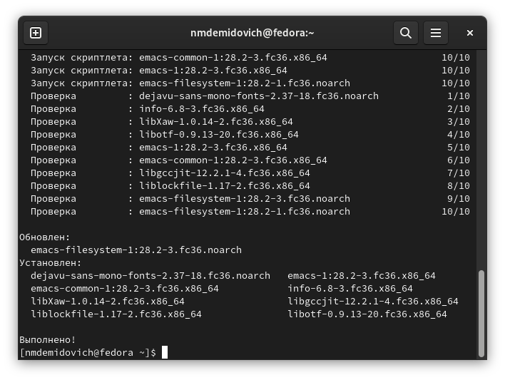{#fig:002 width=70%}

Далее я создал каталог lab07 и файл lab07.sh с помощью комбинации Ctrl-x Ctrl-f и открыл его с помощью Emacs (рис. [-@fig:003]) - (рис. [-@fig:004]):

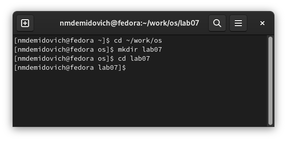{#fig:003 width=70%}

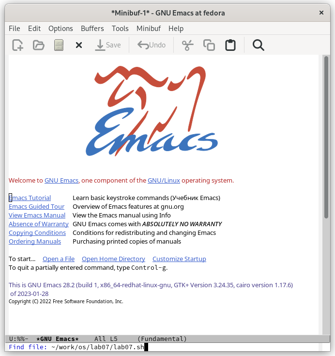{#fig:004 width=70%}

Далее я приступил к его редактированию и ввёл следующий текст (рис. [-@fig:005]):

```#!/bin/bash
HELL=Hello
function hello {
	LOCAL HELLO=World
	echo $HELLO`
}
echo $HELLO
hello
```

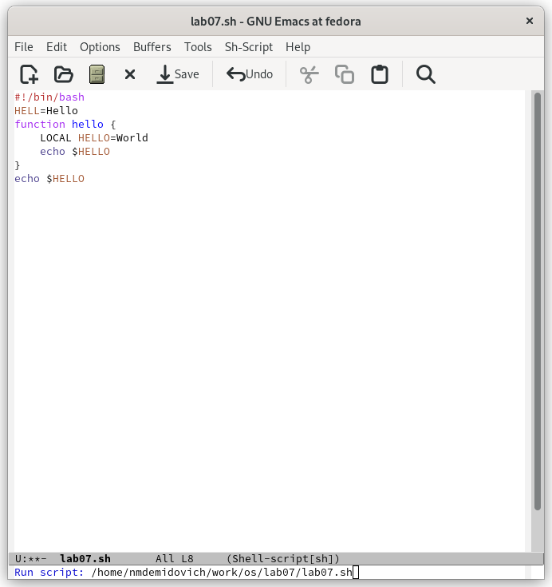{#fig:005 width=70%}

Затем я сохранил файл с помощью комбинации Ctrl-x Ctrl-s и проделал с текстом следующие стандартные процедуры редактирования (пункт №5 из заданий лабораторной работы):

   - 5.1. Вырезал одной командой целую строку (С-k) (рис. [-@fig:006]):
   
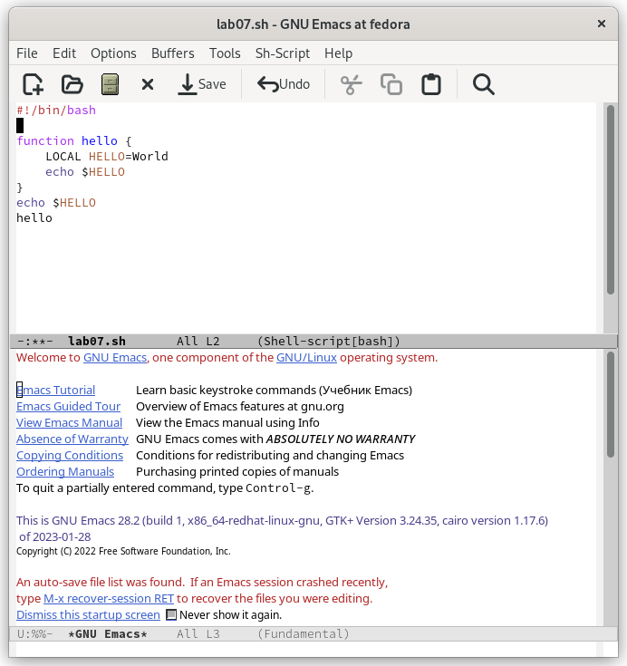{#fig:006 width=70%}

   - 5.2. Вставил эту строку в конец файла (C-y) (рис. [-@fig:007]):
   
{#fig:007 width=70%}

   - 5.3. Выделил область текста (C-space) (рис. [-@fig:008]):
   
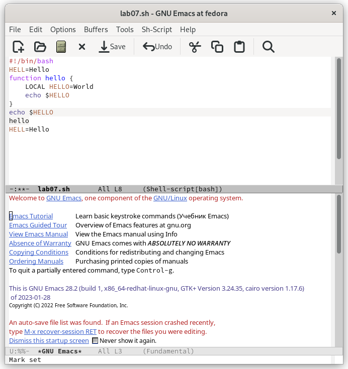{#fig:008 width=70%}

   - 5.4. Скопировал область в буфер обмена (M-w).

   - 5.5. Вставил область в конец файла (рис. [-@fig:009]):
   
{#fig:009 width=70%}

   - 5.6. Вновь выделил эту область и на этот раз вырезал её (C-w) (рис. [-@fig:010]):
   
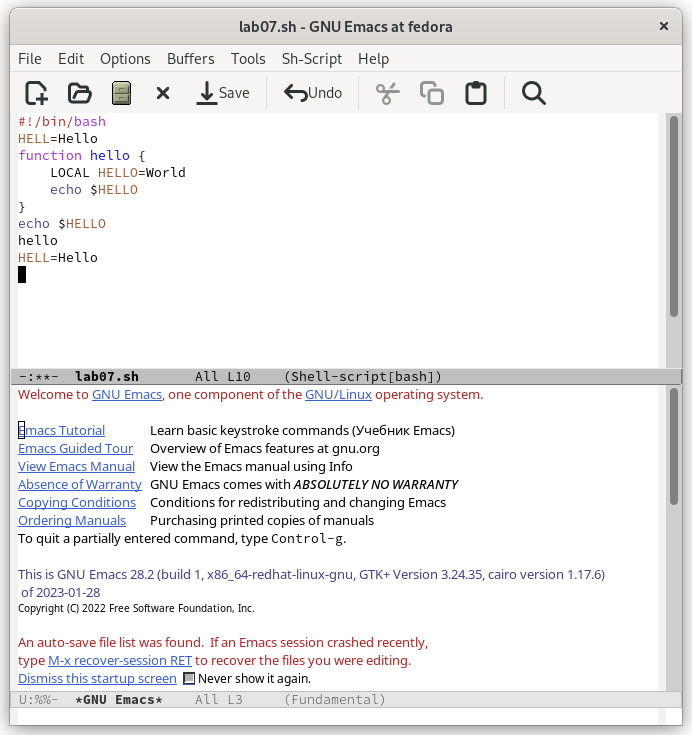{#fig:010 width=70%}

   - 5.7. Отменил последнее действие (C-/) (рис. [-@fig:011]):
   
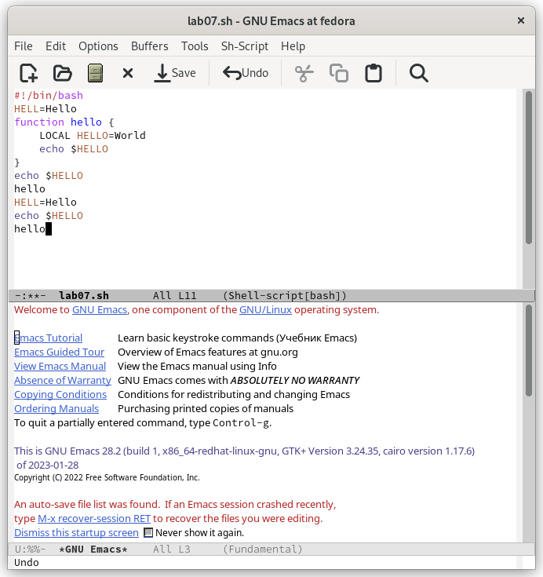{#fig:011 width=70%}

Далее мною были использованы команды по перемещению курсора (пункт №6 из заданий лабораторной работы):

   - 6.1. Переместил курсор в начало строки (C-a) (рис. [-@fig:012]):
   
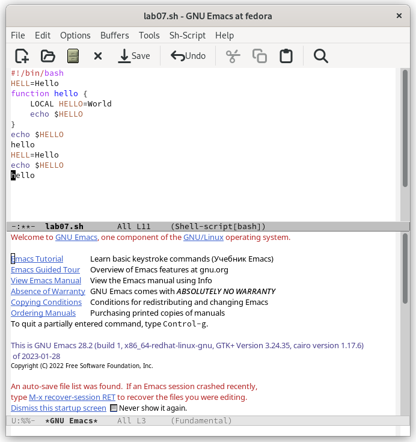{#fig:012 width=70%}

   - 6.2. Переместил курсор в конец строки (C-e) (рис. [-@fig:013]):
   
{#fig:013 width=70%}

   - 6.3. Переместил курсор в начало буфера (M-<) (рис. [-@fig:014]):
   
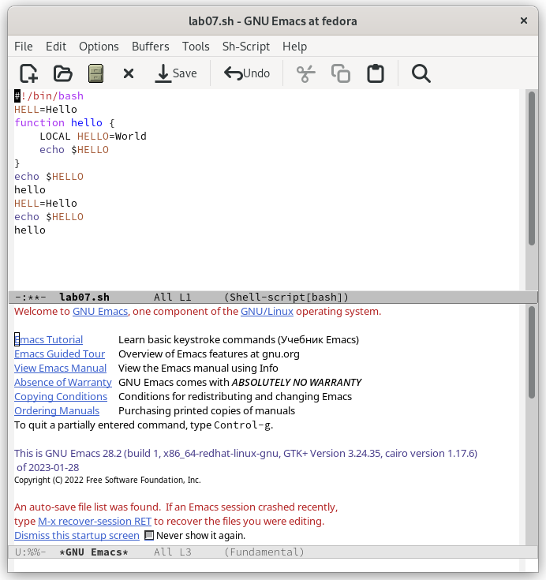{#fig:014 width=70%}
 
   - 6.4. Переместил курсор в конец буфера (M->) (рис. [-@fig:015]):
   
{#fig:015 width=70%}

Затем я научился управлять буферами (пункт №7 из заданий лабораторной работы), выполнив следующие действия:

   - 7.1. Вывел список активных буферов на экран (C-x C-b) (рис. [-@fig:016]):
   
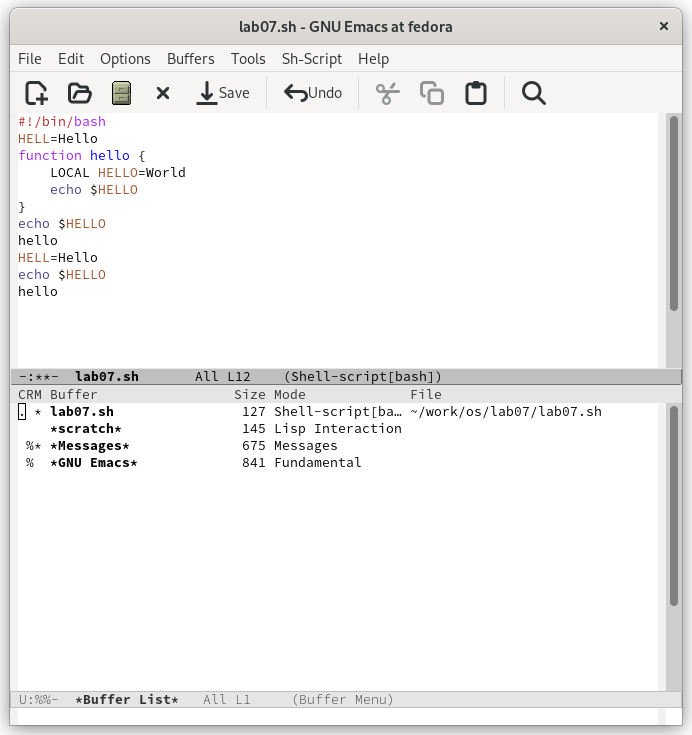{#fig:016 width=70%}

   - 7.2. Переместился во вновь открытое окно (C-x) o со списком открытых буферов и переключился на другой буфер (рис. [-@fig:017]):
   
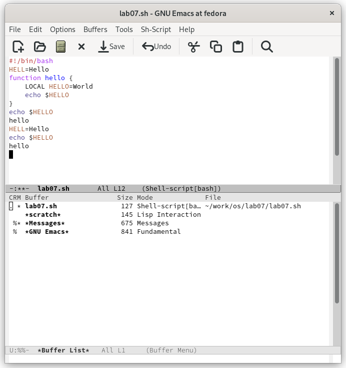{#fig:017 width=70%}

   - 7.3. Закрыл это окно (C-x 0) (рис. [-@fig:018]):
   
{#fig:018 width=70%}

   - 7.4. Теперь вновь переключился между буферами, но уже без вывода их списка на экран (C-x b).

После этого я изучил принцип управления окнами (пункт №8 из заданий лабораторной работы), произведя следующие действия:

   - 8.1. Поделил фрейм на 4 части: разделил фрейм на два окна по вертикали (C-x 3), а затем каждое из этих окон на две части по горизонтали (C-x 2) (рис. [-@fig:019]):
   
{#fig:019 width=70%}

   - 8.2. В каждом из четырёх созданных окон открыл новый буфер (файл) и ввел несколько строк текста (рис. [-@fig:020]):
   
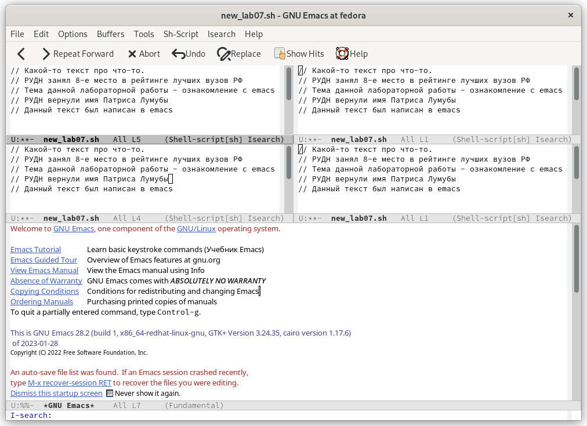{#fig:020 width=70%}

Для этого мною был создан новый файл new_lab07.sh.

И на финальном этапе выполнения данной лабораторной работы я познакомился с режимом поиска в Emacs (пункт №9 из заданий лабораторной работы):

   - 9.1. Переключился в режим поиска (C-s) и найдите несколько слов, присутствующих в тексте (рис. [-@fig:021]):
   
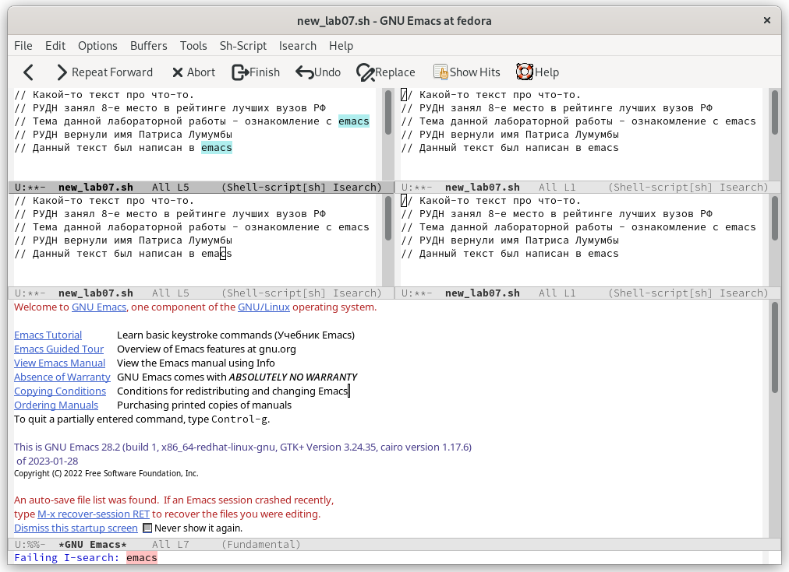{#fig:021 width=70%}

   - 9.2. Переключился между результатами поиска, нажимая C-s.

   - 9.3. Вышел из режима поиска, нажав C-g (рис. [-@fig:022]):
   
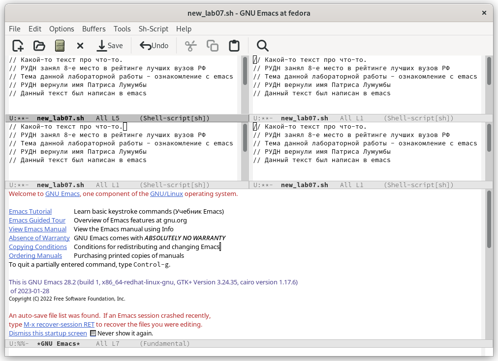{#fig:022 width=70%}

   - 9.4. Перешел в режим поиска и замены (M-%), ввел текст, который следует найти и заменить, нажал Enter, затем ввел текст для замены и нажал ! для подтверждения замены (рис. [-@fig:023]):
   
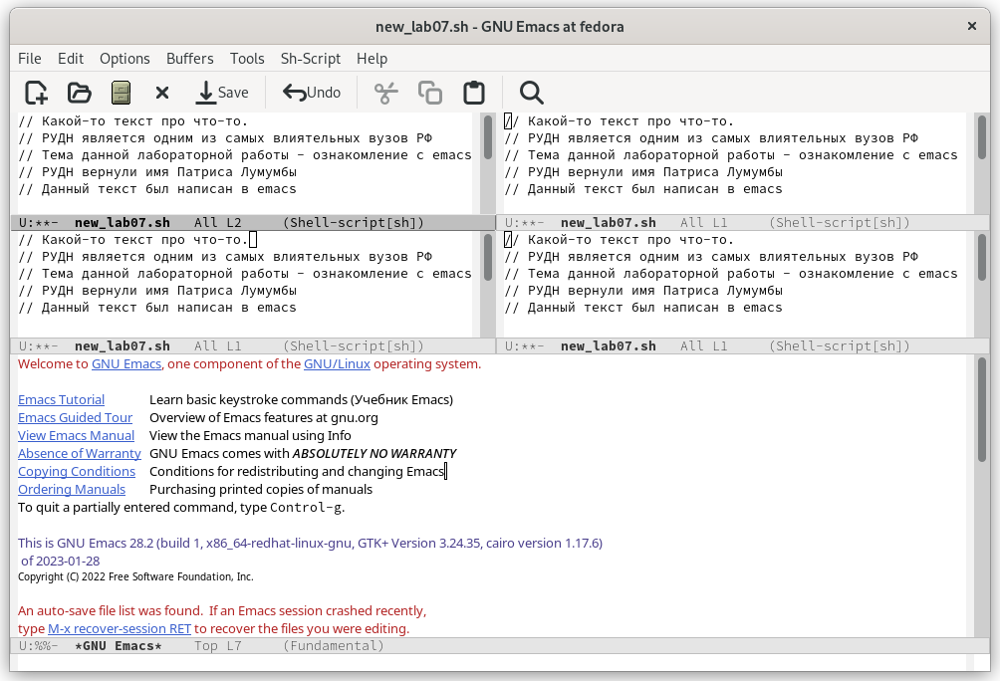{#fig:023 width=70%}

   - 9.5. Испробовал другой режим поиска, нажав M-s o. 
Отличие от обычного режима в том, что тут появляется отдельное окно с текстом из файла с выделенными словами, которые нужно было найти.

# Контрольные вопросы

1. Кратко охарактеризуйте редактор emacs.

Emacs — один из наиболее мощных и широко распространённых редакторов, используемых в мире UNIX. Написан на языке высокого уровня Lisp.

2. Какие особенности данного редактора могут сделать его сложным для освоения новичком?

Большое разнообразие сложных комбинаций клавиш, которые необходимы для редактирования файла и в принципе для работа с Emacs.

3. Своими словами опишите, что такое буфер и окно в терминологии emacs’а.

Буфер - это объект в виде текста. Окно - это прямоугольная область, в которой отображен буфер.

4. Можно ли открыть больше 10 буферов в одном окне?

Да, можно.

5. Какие буферы создаются по умолчанию при запуске emacs?

Emacs использует буферы с именами, начинающимися с пробела, для внутренних целей. Отчасти он обращается с буферами с такими именами особенным образом -- например, по умолчанию в них не записывается информация для отмены изменений.

6. Какие клавиши вы нажмёте, чтобы ввести следующую комбинацию C-c | и C-c C-|?

Ctrl + c, а потом | и Ctrl + c Ctrl + |

7. Как поделить текущее окно на две части?

С помощью команды Ctrl + x 3 (по вертикали) и Ctrl + x 2 (по горизонтали).

8. В каком файле хранятся настройки редактора emacs?

Настройки emacs хранятся в файле . emacs, который хранится в домашней дирректории пользователя. Кроме этого файла есть ещё папка . emacs.

9. Какую функцию выполняет клавиша и можно ли её переназначить?

Выполняет фугкцию стереть, думаю можно переназначить.

10. Какой редактор вам показался удобнее в работе vi или emacs? Поясните почему.

Для меня удобнее был редактор Emacs, так как у него есть командая оболочка. А vi открывается в терминале, и выглядит своеобразно.

# Выводы

В результате выполнения данной лабораторной работы я продолжил знакомство с операционной системой Linux и получил практические навыки по работе с редактором Emacs.

# Список литературы{.unnumbered}

Лабораторная работа №9 (Архитектура ОС)
