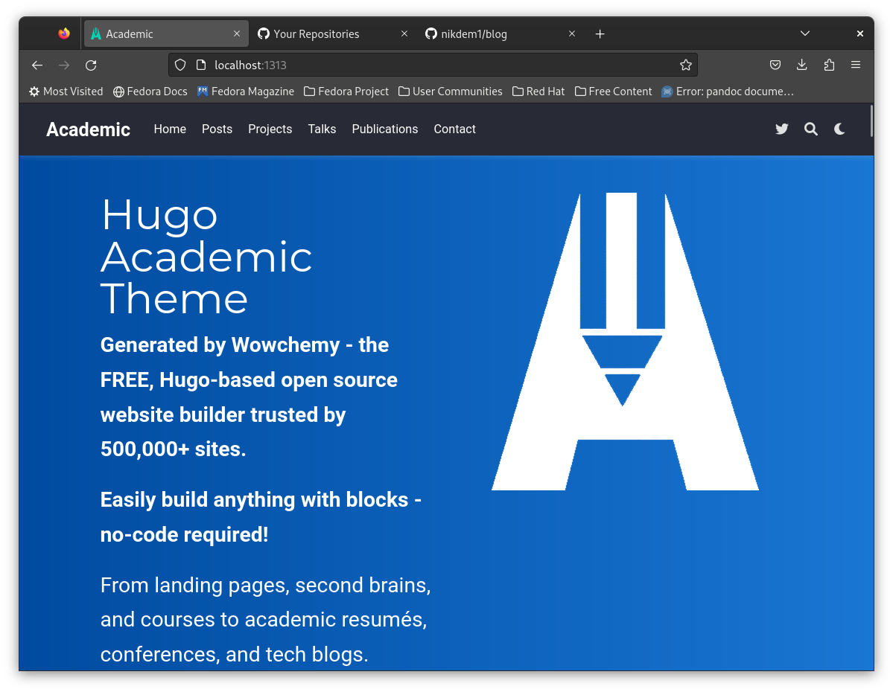
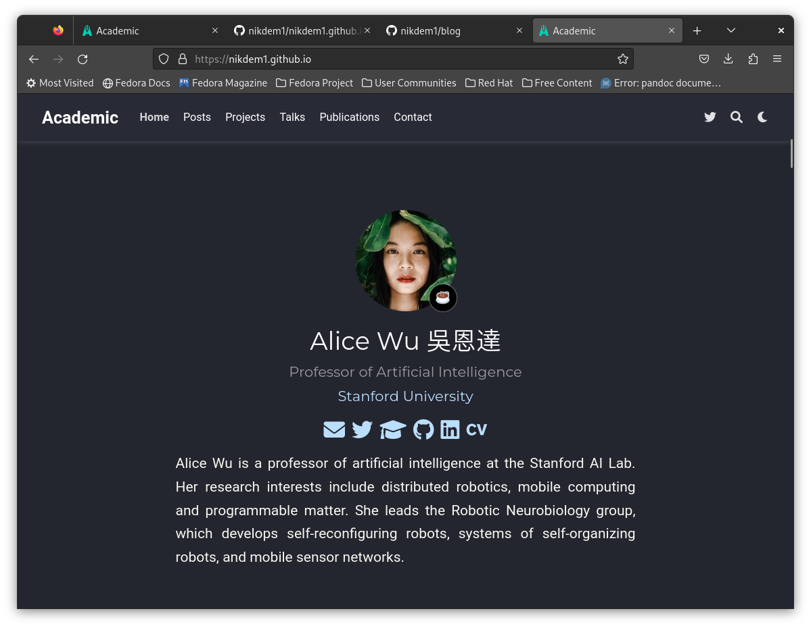

---
## Front matter
title: "Отчёт о выполнении. Индивидуальный проект. Этап 1"
subtitle: "НКАбд-01-22"
author: "Демидович Михайлович Никита"

## Generic otions
lang: ru-RU
toc-title: "Содержание"

## Bibliography
bibliography: bib/cite.bib
csl: pandoc/csl/gost-r-7-0-5-2008-numeric.csl

## Pdf output format
toc: true # Table of contents
toc-depth: 2
lof: true # List of figures
lot: true # List of tables
fontsize: 12pt
linestretch: 1.5
papersize: a4
documentclass: scrreprt
## I18n polyglossia
polyglossia-lang:
  name: russian
  options:
	- spelling=modern
	- babelshorthands=true
polyglossia-otherlangs:
  name: english
## I18n babel
babel-lang: russian
babel-otherlangs: english
## Fonts
mainfont: PT Serif
romanfont: PT Serif
sansfont: PT Sans
monofont: PT Mono
mainfontoptions: Ligatures=TeX
romanfontoptions: Ligatures=TeX
sansfontoptions: Ligatures=TeX,Scale=MatchLowercase
monofontoptions: Scale=MatchLowercase,Scale=0.9
## Biblatex
biblatex: true
biblio-style: "gost-numeric"
biblatexoptions:
  - parentracker=true
  - backend=biber
  - hyperref=auto
  - language=auto
  - autolang=other*
  - citestyle=gost-numeric
## Pandoc-crossref LaTeX customization
figureTitle: "Рис."
tableTitle: "Таблица"
listingTitle: "Листинг"
lofTitle: "Список иллюстраций"
lotTitle: "Список таблиц"
lolTitle: "Листинги"
## Misc options
indent: true
header-includes:
  - \usepackage{indentfirst}
  - \usepackage{float} # keep figures where there are in the text
  - \floatplacement{figure}{H} # keep figures where there are in the text
---

# Цель работы

Целью первого этапа индивидуального проекта является создание всех необходимых репозиториев и установка ПО, необходимого для дальнейшего создания сайта с использование хостинга GitHub.

# Задание

- 1. Установить необходимое программное обеспечение.
- 2. Скачать шаблон темы сайта.
- 3. Создать репозиторий для дальнейшей работы.
- 4. Разместить сайт в сети Интернет, используя хостинг GitHub.

# Выполнение лабораторной работы

На первом этапе выполнения индивидуального проекта я произвёл установку Golang для успешной компиляции шаблона сайта (рис. @fig:001).

{#fig:001 width=70%}

Затем я скопировал репозиторий, который впоследствии будет использован нами для дальнейшего редактирования шаблона сайта (рис. @fig:002).

{#fig:002 width=70%}

{#fig:003 width=70%}

Далее я через терминал произвёл инсталляцию Hugo (рис. @fig:004).

{#fig:004 width=70%}

После этого я удалил подкаталог "public" (рис. @fig:005).

{#fig:005 width=70%}

Затем я выполнил команду "hugo server" (рис. @fig:006).

{#fig:006 width=70%}

Далее я скопировал полученную в терминале ссылку и перешёл на наш локальный сайт (рис. @fig:007).

{#fig:007 width=70%}

Затем я создал новый репозиторий для дальнейшего устройства хостинга на сайте GitHub (рис. @fig:008).

{#fig:008 width=70%}

После этого я произвёл клонирование данного репозитория (рис. @fig:009).

{#fig:009 width=70%}

Далее я создал новую ветку под названием "main" и файл README.md, после чего убедился, что файл был успешно создан (рис. @fig:010).

{#fig:010 width=70%}

Затем я отправил файлы на сервер (рис. @fig:011).

{#fig:011 width=70%}

И убедился в том, что всё прошло успешно (рис. @fig:012).

{#fig:012 width=70%}

После этого я подключил новый репозиторий к подкаталогу "public" (из своего подкаталога "blog") (рис. @fig:013) - (рис. @fig:015).

{#fig:013 width=70%}

{#fig:014 width=70%}

{#fig:015 width=70%}

Далее я произвёл инсталляцию Hugo в новом каталоге (рис. @fig:016).

{#fig:016 width=70%}

Затем я убедился, что подкаталог "public" связан с репозиторием на GitHub (рис. @fig:017).

{#fig:017 width=70%}

После этого я добавил шаблон сайта (рис. @fig:018).

{#fig:018 width=70%}

И отправил файлы на сервер (рис. @fig:019).

{#fig:019 width=70%}

Далее я убедился в том, что все файлы были успешно отправлены на новый репозиторий nikdem1.github.io (рис. @fig:020).

{#fig:020 width=70%}

После чего я открыл сгенерированный сайт (рис. @fig:021).

{#fig:021 width=70%}

# Выводы

В результате выполнения первого этапа индивидуального проекта я создал все необходимые репозитории и произвёл установку ПО, необходимого для дальнейшего создания сайта с использование хостинга GitHub.

# Список литературы{.unnumbered}

1. Видеролик "Первый этап индивидуального проекта" на YouTube (ссылка: https://www.youtube.com/watch?v=OpsSv0RE3C4&ab_channel=DmitryKulyabov)
2. Этапы реализации проекта
