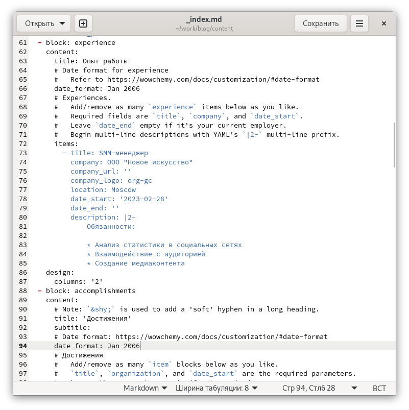

---
## Front matter
title: "Отчёт о выполнении. Индивидуальный проект. Этап 3"
subtitle: "НКАбд-01-22"
author: "Никита Михайлович Демидович"

## Generic otions
lang: ru-RU
toc-title: "Содержание"

## Bibliography
bibliography: bib/cite.bib
csl: pandoc/csl/gost-r-7-0-5-2008-numeric.csl

## Pdf output format
toc: true # Table of contents
toc-depth: 2
lof: true # List of figures
lot: true # List of tables
fontsize: 12pt
linestretch: 1.5
papersize: a4
documentclass: scrreprt
## I18n polyglossia
polyglossia-lang:
  name: russian
  options:
	- spelling=modern
	- babelshorthands=true
polyglossia-otherlangs:
  name: english
## I18n babel
babel-lang: russian
babel-otherlangs: english
## Fonts
mainfont: PT Serif
romanfont: PT Serif
sansfont: PT Sans
monofont: PT Mono
mainfontoptions: Ligatures=TeX
romanfontoptions: Ligatures=TeX
sansfontoptions: Ligatures=TeX,Scale=MatchLowercase
monofontoptions: Scale=MatchLowercase,Scale=0.9
## Biblatex
biblatex: true
biblio-style: "gost-numeric"
biblatexoptions:
  - parentracker=true
  - backend=biber
  - hyperref=auto
  - language=auto
  - autolang=other*
  - citestyle=gost-numeric
## Pandoc-crossref LaTeX customization
figureTitle: "Рис."
tableTitle: "Таблица"
listingTitle: "Листинг"
lofTitle: "Список иллюстраций"
lotTitle: "Список таблиц"
lolTitle: "Листинги"
## Misc options
indent: true
header-includes:
  - \usepackage{indentfirst}
  - \usepackage{float} # keep figures where there are in the text
  - \floatplacement{figure}{H} # keep figures where there are in the text
---

# Цель работы

Продолжить работу со своим сайтом. Отредактировать его в соответствии с требованиями. Добавить к нему информацию о навыках, опыте, достижениях, написать два поста, а также добавить ссылки на научные и библиометрические ресурсы.

# Задание

1. Список достижений:

   1. Добавить информацию о навыках (Skills).

   2. Добавить информацию об опыте (Experience).

   3. Добавить информацию о достижениях (Accomplishments).

2. Сделать пост по прошедшей неделе.

3. Добавить пост на тему по выбору:

   1. Легковесные языки разметки.
  
   2. Языки разметки. LaTeX.
  
   3. Язык разметки Markdown.
  
4. Добавить к сайту ссылки на научные и библиометрические ресурсы.

# Теоретическое введение

Сайт – это совокупность веб-страниц, объединённых под общим доменом и связанных ссылками, тематикой и дизайнерским оформлением. Мы будем создавать статический сайт, для этого нам понадобится Hugo. Hugo — это генератор статических страниц для интернета.

# Выполнение лабораторной работы

На первом этапе выполнения третьего этапа индивидуального проекта я разместил на сайте информацию о навыках, опыте и достижениях (рис. [-@fig:001]) - (рис. [-@fig:002]).

{#fig:001 width=70%}

{#fig:002 width=70%}

Далее я опубликовал пост по прошедшей неделе, а также пост на тему по выбору. Мною была выбрана тема №3 - "Язык разметки Markdown" (рис. [-@fig:003]) - (рис. [-@fig:006]).

{#fig:003 width=70%}

{#fig:004 width=70%}

{#fig:005 width=70%}

{#fig:006 width=70%}

Затем я добавил на сайт ссылки на научные и библиометрические ресурсы, после чего обновил его (рис. [-@fig:007]) - (рис. [-@fig:020]).

{#fig:007 width=70%}

{#fig:008 width=70%}

{#fig:009 width=70%}

{#fig:010 width=70%}

{#fig:011 width=70%}

{#fig:012 width=70%}

{#fig:013 width=70%}

{#fig:014 width=70%}

{#fig:015 width=70%}

{#fig:016 width=70%}

{#fig:017 width=70%}

{#fig:018 width=70%}

{#fig:019 width=70%}

{#fig:020 width=70%}

# Выводы

В результате выполнения данного этапа индивидуального проекта я продолжил работу со своим сайтом, отредактировал его в соответствии с требованиями, добавил к нему информацию о навыках, опыте, достижениях, написал два поста, а также добавил ссылки на научные и библиометрические ресурсы.

# Список литературы{.unnumbered}

Этапы реализации проекта
