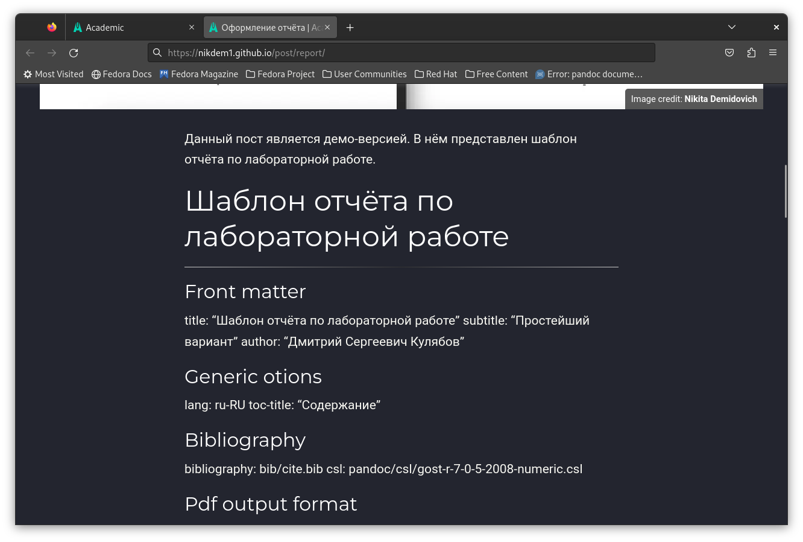

---
## Front matter
title: "Отчёт о выполнении. Индивидуальный проект. Этап 4"
subtitle: "НКАбд-01-22"
author: "Никита Михайлович Демидович"

## Generic otions
lang: ru-RU
toc-title: "Содержание"

## Bibliography
bibliography: bib/cite.bib
csl: pandoc/csl/gost-r-7-0-5-2008-numeric.csl

## Pdf output format
toc: true # Table of contents
toc-depth: 2
lof: true # List of figures
lot: true # List of tables
fontsize: 12pt
linestretch: 1.5
papersize: a4
documentclass: scrreprt
## I18n polyglossia
polyglossia-lang:
  name: russian
  options:
	- spelling=modern
	- babelshorthands=true
polyglossia-otherlangs:
  name: english
## I18n babel
babel-lang: russian
babel-otherlangs: english
## Fonts
mainfont: PT Serif
romanfont: PT Serif
sansfont: PT Sans
monofont: PT Mono
mainfontoptions: Ligatures=TeX
romanfontoptions: Ligatures=TeX
sansfontoptions: Ligatures=TeX,Scale=MatchLowercase
monofontoptions: Scale=MatchLowercase,Scale=0.9
## Biblatex
biblatex: true
biblio-style: "gost-numeric"
biblatexoptions:
  - parentracker=true
  - backend=biber
  - hyperref=auto
  - language=auto
  - autolang=other*
  - citestyle=gost-numeric
## Pandoc-crossref LaTeX customization
figureTitle: "Рис."
tableTitle: "Таблица"
listingTitle: "Листинг"
lofTitle: "Список иллюстраций"
lotTitle: "Список таблиц"
lolTitle: "Листинги"
## Misc options
indent: true
header-includes:
  - \usepackage{indentfirst}
  - \usepackage{float} # keep figures where there are in the text
  - \floatplacement{figure}{H} # keep figures where there are in the text
---

# Цель работы

Продолжить работу со своим сайтом. Отредактировать его в соответствии с требованиями. Зарегистрироваться на соответствующих ресурсах и разместить на них ссылки на сайте, а также написать два поста.

# Задание

1. Зарегистрироваться на соответствующих ресурсах и разместить на них ссылки на сайте:
   1. eLibrary: `https://elibrary.ru/`;
   2. Google Scholar: `https://scholar.google.com/`;
   3. ORCID: `https://orcid.org/`;
   4. Mendeley: `https://www.mendeley.com/`;
   5. ResearchGate: `https://www.researchgate.net/`;
   6. Academia.edu: `https://www.academia.edu/`;
   7. arXiv: `https://arxiv.org/`;
   8. GitHub: `https://github.com/`.
2. Сделать пост по прошедшей неделе.
3. Добавить пост на тему по выбору:
   1. Оформление отчёта.
   2. Создание презентаций.
   3. Работа с библиографией.
4. Добавить к сайту ссылки на научные и библиометрические ресурсы.

# Теоретическое введение

Сайт – это совокупность веб-страниц, объединённых под общим доменом и связанных ссылками, тематикой и дизайнерским оформлением. Мы будем создавать статический сайт, для этого нам понадобится Hugo. Hugo — это генератор статических страниц для интернета.

# Выполнение лабораторной работы

1. На первом этапе выполнения данной части индивидуального проекта я зарегистрировался на всех необходимых ресурсах (рис. [-@fig:001]) - (рис. [-@fig:030]):

   1. eLibrary: `https://elibrary.ru/` (рис. [-@fig:001]) - (рис. [-@fig:003]):

{#fig:001 width=70%}

{#fig:002 width=70%}

{#fig:003 width=70%}
 
   2. Google Scholar: `https://scholar.google.com/` (рис. [-@fig:004]):

Я авторизировался через свой личный аккаунт Google.

{#fig:004 width=70%}

   3. ORCID: `https://orcid.org/` (рис. [-@fig:005]) - (рис. [-@fig:009]):

{#fig:005 width=70%}

{#fig:006 width=70%}

{#fig:007 width=70%}

{#fig:008 width=70%}

{#fig:009 width=70%}

   4. Mendeley: `https://www.mendeley.com/` (рис. [-@fig:010]) - (рис. [-@fig:013]):

{#fig:010 width=70%}

{#fig:011 width=70%}

{#fig:012 width=70%}

{#fig:013 width=70%}

   5. ResearchGate: `https://www.researchgate.net/` (рис. [-@fig:014]) - (рис. [-@fig:019]):

{#fig:014 width=70%}

{#fig:015 width=70%}

{#fig:016 width=70%}

{#fig:017 width=70%}

{#fig:018 width=70%}

{#fig:019 width=70%}

   6. Academia.edu: `https://www.academia.edu/` (рис. [-@fig:020]) - (рис. [-@fig:025]):

{#fig:020 width=70%}

{#fig:021 width=70%}

{#fig:022 width=70%}

{#fig:023 width=70%}

{#fig:024 width=70%}

{#fig:025 width=70%}

   7. arXiv: `https://arxiv.org/` (рис. [-@fig:026]) - (рис. [-@fig:029]):

{#fig:026 width=70%}

{#fig:027 width=70%}

{#fig:028 width=70%}

{#fig:029 width=70%}

   8. GitHub: `https://github.com/` (рис. [-@fig:030]):

Регистрации на GitHub не потребовалось, т.к я уже имел аккаунт на данном ресурсе.

{#fig:030 width=70%}

2. Далее я создал пост по прошедшей неделе (рис. [-@fig:031]) - (рис. [-@fig:032]):

{#fig:031 width=70%}

{#fig:032 width=70%}

3. Затем я написал пост на тему по выбору. Мною была выбрана тема "Оформление отчёта" (рис. [-@fig:033]):

{#fig:033 width=70%}

4. И на финальном этапе выполнения данной работы я добавил ссылки на научные и библиометрические ресурсы (рис. [-@fig:034]):

{#fig:034 width=70%}

После этого я обновил сайт и проверил изменения (рис. [-@fig:035]) - (рис. [-@fig:046]):

{#fig:035 width=70%}

{#fig:036 width=70%}

*В левом нижнем углу видна ссылка на аккаунт на ресурсе `https://www.academia.edu/`. Ссылка рабочая и была успешно открыта в браузере (соседняя вкладка)*

{#fig:037 width=70%}

{#fig:038 width=70%}

{#fig:039 width=70%}

{#fig:040 width=70%}

{#fig:041 width=70%}

{#fig:042 width=70%}

{#fig:043 width=70%}

{#fig:044 width=70%}

{#fig:045 width=70%}

{#fig:046 width=70%}

# Выводы

В результате выполнения данного этапа индивидуального проекта я продолжил работу со своим сайтом, отредактировал его в соответствии с требованиями, зарегистрировался на соответствующих ресурсах и разместил на них ссылки на сайте, а также написал два поста.

# Список литературы{.unnumbered}

Этапы реализации проекта
